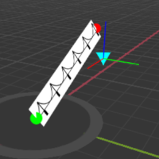
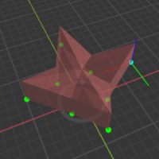

# FD Demo

There are two tasks this demo was created to show and explain how it was done.
1. Render a textured line that can have its starting/ending points defined plus thickness. The Texture should be rendered with its height stretching to match
the thickness of the line, while the width of the texture gets repeated the total length of the line.

2. Create a 2D Polygon that gets extruded and turned into a 3D model. As a bonus, make it render with some transparency 

# How to view examples
- Best viewed on a Chrome Browser.
- For convience sake, i posted the examples to my personal website to make it easier to quickly view them without any setup.
- IF you want to run these samples locally, you would need a webserver to make it work. Since I'm using ES JS Modules, the browser will not allow those to run off the harddrive because of security concerns. An easy option is a chrome extension that allows you to run a local webserver on your computer for development. Its super easy to get started with it: https://chrome.google.com/webstore/detail/web-server-for-chrome/ofhbbkphhbklhfoeikjpcbhemlocgigb?hl=en

# Examples

 

Launch Demo : [001_textured_line.html](http://fungi.sketchpunk.com/temp/fd_demo/001_textured_line.html)

The first thing I needed to for this task was to render out a Quad with a Texture. Once I had that working well I started to break down how to reshape the quad
so that it can look like a line that can have its thickness changed along with starting and ending positions changed by the user.

First I tackled how to stretch the quad. In the vertices, I changed the data from a Vec3 to a Vec4 then stored an Identifier value in the W component. Basicly doing "Vertex Groups" in tools like blender 3d. I define two groups, 0:Left and 1:Right. From there I pass in a Vec3 Array to the shader as a uniform that holds the starting and end positions of a line. So using the Vertex Group ID as an Array Index, it was easy to then use the line points as a reference to move the left and right vertices into the correct world space position.

Next thing I wanted to do was how to repeat the texture along the stretched quad. Since I had both points in the uniform, I would then compute the length of the line. From there I would create a Fragment Length value for the vertex that will get passed to the fragment shader. So if the vertex is from the Left Group, it has 0 length, if its the right it has the total length of the line. During this part I also started passing in the thickness value of the line, so I divided that by Half then multiply it by Y value of the vertex. In the Vertices i set Y for the top verts set a 1, and bottom as -1, so using these unit values to makes it easy to multiply the height by Y to move the vertex to the correct place either up or down. I also pass the thickness value to the fragment shader.

In the fragment shader, I chose to use the Thickness value to also be the "Width" value of how to render a square. This works with conjection of the Fragment Length value I passed per vertex. Since the fragment shader interpolates all the vertex data passed to it, it was then easy to use this length to determine the length of each pixel is away from the start of the line. Take that Fragment length divided by the Thickness would then give me how many squares I can render on the line. From there, I only need the fractional part of the value which then is used as the X uv coordnate to read from the texture. Doing so then makes repeating the texture on the line possible. Why the fractional only? Because the whole number represents how many squares should already have been rendered on the quad, so the fractional part says how much of the last square hasn't been rendered yet.

Since this is done in 3d, I wanted to be able be able to move the points around and point the quad's normal at any specific direction. So I added a 3rd point that gets passed in to the shader. In the vertex shader I use the direction from the start to the end of the line as the LEFT axis direction. From there, I use an equation get gets the closets point on a line FROM a point. Using those to points to determine what the FORWARD Axis Direction is. Then finish it off by using the Cross product to get the Up direction. Now that I have an Axis defined, I decided change how the vertices get moved around. I take the vertex group ID to get the point of the line (start / end), then treat that as an origin position, then use the axis and thickness value to shift the vertex away from that origin point. This basically gives me the ability to "rotate" the quad to point toward a specific direction.
 

~ ~ ~ ~ ~ ~ ~ ~ ~ ~ ~ ~ ~ ~ ~ ~ ~ ~ ~ ~ ~

 

Launch Demo : [002_3d_shape.html](http://fungi.sketchpunk.com/temp/fd_demo/002_3d_shape.html)

For this task, the first thing I did was dig out an algorithm I found a long while ago that can draw N-Pointed 2D Stars. I used that to define the points in local space for the shape.

With a Flat Array of vertex points, I created a new Type Array that will be able to hold all the vertices to turn the 2D Shape into 3d. The first step is to save the 2D shape twice in this new buffer, with the only difference is that the second copy will have its vertices shift to a new origin position,  is this case just changing its Y to move it up, the basic idea of extruding vertices. From there, I took the Flat shape and computed its centroid then added that to the buffer to match the bottom and top copies of the 2d shape.

With all the vertices defined, the next step is to start creating the triangles from it. As long as all the points are in the right order, it is easy to loop the index values like a grid. The top and bottom shapes can be seen as a grid of 2 rows and N Columns. The algorithm basicly just loops through the rows at 2 at a time and by 2 columns at a time. Doing so you get 4 points at each iteration that I can use to define a quad, once I have those indexes that should bewound in the same direction, it is easy to use an ABC CDA format to define 2 Triangles. This basicly stitches the two 2D shapes together, i normally call it making the wall, kinda like making a cylinder.

With the wall out of the way, I need to create the triangles for the top and bottom openings. This is where the centroid comes in, using that as a center I can then loop around the shape's edge to triangluate things as a Fan. From there all the points of the 3d Shape should now be assigned to at least one triangle.

From there I just do the usual passing of the data to GPU Buffers and setup a VAO for easy binding when it is time to render. The only difference I did here is that I set the vertices buffer to be dynamic instead of static. The reason I did this was so that the 2D shape I original create can then be used to recreate the vertices after the user uses the Translate Gizmo to move those points around. So as the user selects and moves the 2d points, I recompute just the vertices and update the GPU buffer with the new data which gives the user realtime updating as they play with the 2D shape. Since only the position of the points are moving, I don't really need to recompute the triangles (indices buffer).

In this situation, I didn't bother to compute the normal directions because I would then need to duplicate vertices for the top and bottom edges if i wanted to keep that sharp edge look when it gets rendered. So instead I use the derivitive functions in GLSL in the fragment shader to compute the normals of the triangle at render time. This also means I dont need to keep track of normals and recompute them every time the user changes the 2d Shape. This approach keeps down the amount of data I need to deal with and push to the gpu.

In the end I tried to get this to be transparent, but I couldn't get it working perfectly. I disabled backfrace culling, turn on blend and Sample Alpha Coverage to try to get all the faces to render. There is still some depth testing at certain angles that you can not see some of the backfaces. I think what would work well would be to generate a wireframe mesh out of the 3d shape mesh, have that render first then render the full shaded shape on top of that so that the depth testing will work out better with alpha blending.
 

~ ~ ~ ~ ~ ~ ~ ~ ~ ~ ~ ~ ~ ~ ~ ~ ~ ~ ~ ~ ~

# Fungi
In this task I used my personal 3D rendering engine that I have built from scratch using WebGL 2.0 and Javascript ES6+.
